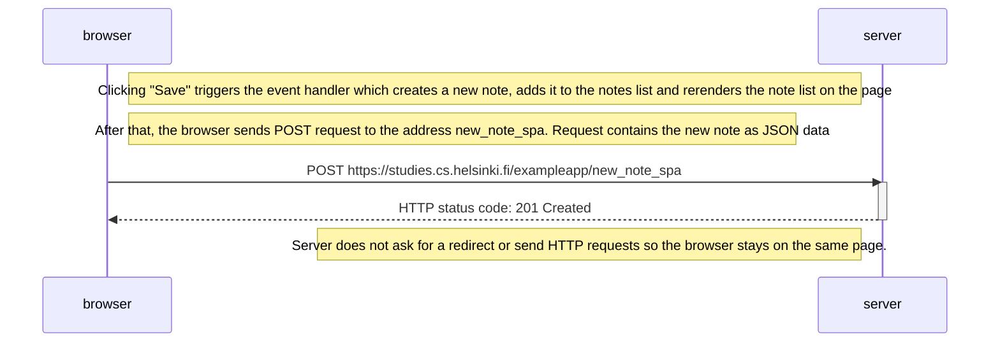

```mermaid
sequenceDiagram
    participant browser
    participant server


    Note right of browser: Clicking "Save" triggers the event handler which creates a new note, adds it to the notes list and rerenders the note list on the page
    Note right of browser: After that, the browser sends POST request to the address new_note_spa. Request contains the new note as JSON data

    browser->>server: POST https://studies.cs.helsinki.fi/exampleapp/new_note_spa
    activate server
    server-->>browser: HTTP status code: 201 Created
    deactivate server

    Note left of server: Server does not ask for a redirect or send HTTP requests so the browser stays on the same page.
```
    
    
